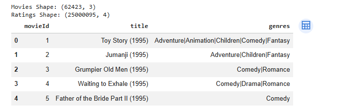
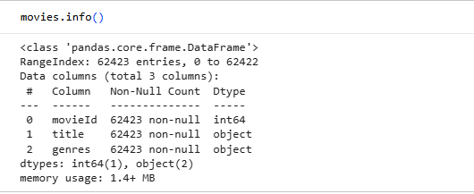
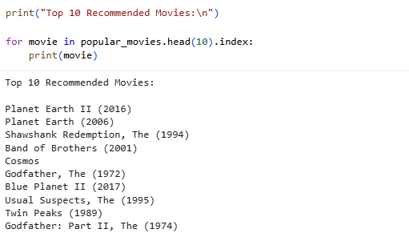
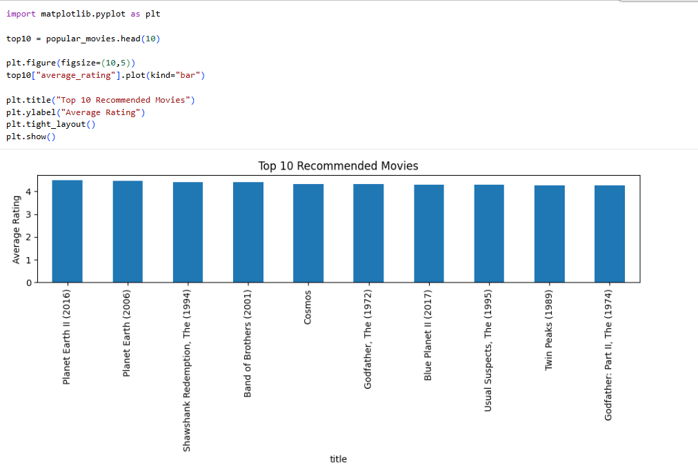

# Movie Recommendation System using Basic Filtering

## 📌 Project Overview

This project implements a Movie Recommendation System using a basic filtering approach. The system analyzes movie ratings from users and recommends highly rated movies based on average ratings and popularity.

The project demonstrates the fundamental concepts of recommendation systems, data analysis, and filtering techniques using Python.

---

## 🎯 Objective

To build a recommendation system that suggests top-rated movies by analyzing user ratings and identifying popular movies with consistently high ratings.

---

## 📊 Dataset

Dataset: MovieLens Dataset

Files Used:

* movies.csv
* ratings.csv

The dataset contains:

* Movie titles
* Genres
* User ratings
* Movie IDs

---

## 🛠 Technologies Used

* Python
* Pandas
* NumPy
* Matplotlib
* Google Colab
* KaggleHub

---

## 🔄 Project Workflow

### Data Collection

The MovieLens dataset was downloaded directly using KaggleHub.

### Data Preprocessing

* Loaded movies and ratings datasets
* Merged datasets using movieId
* Checked dataset structure and quality

### Recommendation Logic

* Calculated average ratings for each movie
* Counted the number of ratings per movie
* Filtered movies with sufficient ratings
* Ranked movies by average rating

### Visualization

Generated a bar chart displaying the Top 10 Recommended Movies.

---

## 📈 Results

Top Recommended Movies:

1. Planet Earth II (2016)
2. Planet Earth (2006)
3. The Shawshank Redemption (1994)
4. Band of Brothers (2001)
5. Cosmos
6. The Godfather (1972)
7. Blue Planet II (2017)
8. The Usual Suspects (1995)
9. Twin Peaks (1989)
10. The Godfather Part II (1974)

The system successfully identified highly-rated movies based on user preferences and rating trends.

---

## 📷 Screenshots

### Dataset Preview

### Dataset Information

### Recommended Movies Output

### Recommendation Visualization

---

## 📁 Project Structure

movie-recommendation-system/

├── Movie_Recommendation_System.ipynb

├── README.md

└── screenshots/

    ├── dataset_preview.png

    ├── data_info.png

    ├── recommendations.png

    └── movie_chart.png

---

## ✅ Conclusion

This project demonstrates a basic movie recommendation system using filtering techniques. By analyzing movie ratings and popularity, the system provides meaningful movie suggestions and introduces core concepts used in modern recommendation engines.
